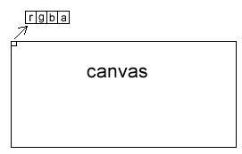

使用canvas滤镜处理图片效果
=======================

在说明实现原理前，我们首先需要知道一些关于canvas操作图片的知识。就是对于一个绘制了图片的canvas，有以下属性：图像数据中的每个像素都是以4个8位二进制证书来保存的，他们分别表示像素的红、绿、蓝以及Alpha分量的取值范围是0~255.如图，加上canvas里的小方框是一个像素点：




## 反向（负片）

由上面的介绍我们可以知道，每个canvas像素点都有r、g、b、a四个点，对于r、g、b，他们的取值都是0-255.因此所谓的反向就是取255与r、g、b值的差值（这里假设obj为像素信息组）：

```js

function inert(obj, i){
	obj[i] = 255 - obj[i]
    obj[i+1] = 255 - obj[i+1];
    obj[i+2] = 255 - obj[i+2];
}

```

## 灰化

对于灰化，一般来说是取r、g、b三个点的平均值，你也可以通过一下代码里的公式，经过测试，效果相同：

```js

function grayscale(obj,i){
    var average = (obj[i] + obj[i+1] + obj[i+2]) / 3;
    //var average = 0.2126*obj[i] + 0.7152*obj[i+1] + 0.0722*obj[i+2]; 或者
    obj[i] = obj[i+1] = obj[i+2] = average;
}

```

## 复古（怀旧）

复古的滤镜效果是通过一组特定的公式：

```js

function sepia(obj , i){
    var r = obj[i],
        g = obj[i+1],
        b = obj[i+2];
    obj[i] = (r*0.393)+(g*0.769)+(b*0.189);
    obj[i+1] = (r*0.349)+(g*0.686)+(b*0.168);
    obj[i+2] = (r*0.272)+(g*0.534)+(b*0.131);
}

```

## 变亮

想让图片变量，最简单1方法就是给每个像素点r、g、b三个点加上一定的数值，这个数值在这里可以作为一个参数：

```js

function brightness(obj , i , brightVal){
    var r = obj[i],
        g = obj[i+1],
        b = obj[i+2];
    obj[i] += brightVal;
    obj[i+1] += brightVal;
    obj[i+2] += brightVal;
}

```

## 阈值

何为阈值，一开始我也不太了解。但当你看到上面的效果是，你就会明白。网上的解释：“阈值”命令将灰度1彩色图像转换为高对比度的黑白图像。您可以指定某个色阶作为阈值。所有比阈值亮1速速快转换成白色；而所有比阈值暗的像素转换成黑色。“阈值”命令对确定图像的最亮和最暗区域很有作用。

那么问题来了，如何才能做出阈值效果呢？

想要得到阈值的效果，可以将灰度值（r、g、b三个点的平均值）与设定的阈值比较，如果大于阈值，则将该店设置为255，否则设置为0.

```js

function threshold(obj , i , thresholdVal){
    var average = (obj[i] + obj[i+1] + obj[i+2]) / 3;
    obj[i] = obj[i+1] = obj[i+2] = average > thresholdVal ? 255 : 0;
}

```

## 模糊

用css3的滤镜可以很轻松的实现模糊效果。但是在canvas里则略显复杂，因此，在这里我使用一个相对成熟的js库-[stackblur](https://github.com/flozz/StackBlur)。

```js

stackBlurCanvasRGBA( "canvas", 0, 0, canvas.width, canvas.height, 10 );

```

它还有以下三种方法，在这里我才用的是第二种

```

Usage: stackBlurImage( sourceImageID, targetCanvasID, radius, blurAlphaChannel );
or: stackBlurCanvasRGBA( targetCanvasID, top_x, top_y, width, height, radius );
or: stackBlurCanvasRGB( targetCanvasID, top_x, top_y, width, height, radius );

```

## 浮雕

浮雕的滤镜效果处理起来还是蛮复杂的，因为像素点的计算要根据它最后一个点和想一行的同一列点，并且只对canvas中每个像素点r、g、b三个点起作用。所以在计算式，要对像素点的最后一列和最后一行做特殊处理：

```js

function relief(obj , i , canvas){
    if ((i+1) % 4 !== 0) { // 每个像素点的第四个（0,1,2,3  4,5,6,7）是透明度。这里取消对透明度的处理
        if ((i+4) % (canvas.width*4) == 0) { // 每行最后一个点，特殊处理。因为它后面没有边界点，所以变通下，取它前一个点
           obj[i] = obj[i-4];
           obj[i+1] = obj[i-3];
           obj[i+2] = obj[i-2];
           obj[i+3] = obj[i-1];
           i+=4;
        }
        else{ // 取下一个点和下一行的同列点
             obj[i] = 255/2         // 平均值
                      + 2*obj[i]   // 当前像素点
                      - obj[i+4]   // 下一点
                      - obj[i+canvas.width*4]; // 下一行的同列点
        }
    }
    else {  // 最后一行，特殊处理
         if ((i+1) % 4 !== 0) {
            obj[i] = obj[i-canvas.width*4];
         }
    }
}

```

## 参考

*	http://www.html5rocks.com/en/tutorials/canvas/imagefilters
*	http://www.quasimondo.com/StackBlurForCanvas/StackBlurDemo.html
